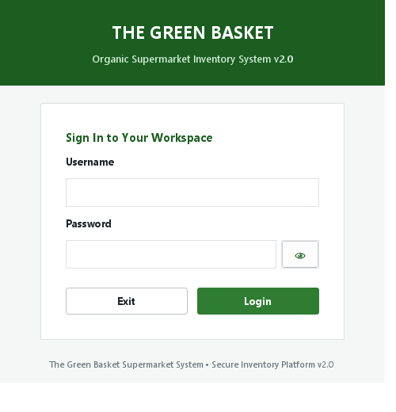
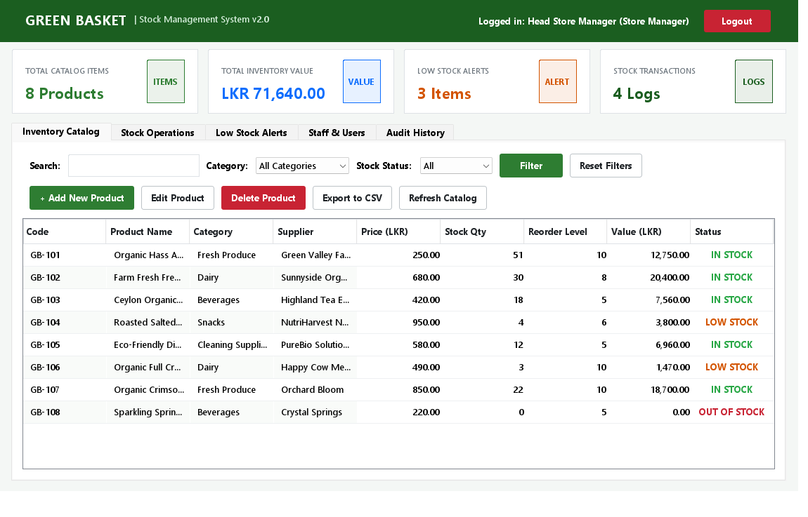

# The Green Basket Supermarket — Inventory & POS System v2.0

[](https://www.oracle.com/java/)
[](https://docs.oracle.com/javase/tutorial/uiswing/)
[](https://junit.org/junit5/)
[](LICENSE)

An enterprise-ready, desktop Inventory Management and Point-of-Sale (POS) application developed for **The Green Basket Supermarket**. Engineered with robust Object-Oriented Programming (OOP) principles, polymorphic role-based access control (RBAC), atomic file persistence, and cryptographic security hardening.

---

## 📸 Screenshots

| Modern Login Interface | Operations Dashboard |
| :---: | :---: |
|  |  |

---

## 🌟 Key Features

- **Inventory Catalog Management**: Full CRUD operations with multi-criteria search (keyword, product category, and real-time stock status).
- **Point of Sale (POS) & Billing**: Atomic stock deduction on customer purchases with instant calculated receipts and checkout summaries.
- **Stock Movement Operations**: Inbound supplier delivery restocking, manual stock level adjustments, and automated stock level reconciliation.
- **Low Stock & Reorder Alerts**: Real-time identification of depleted inventory with one-click quick restock workflows.
- **Audit Logging & Transaction History**: Immutable ledger recording every inventory alteration (RESTOCK, SALE, ADJUSTMENT) with timestamps and operator signatures.
- **Sanitized CSV Exports**: Comprehensive reporting tools for both catalog inventory and audit trails with built-in spreadsheet injection defenses.

---

## 🏛️ System Architecture & OOP Design

The codebase strictly adheres to a clean, 4-tier separation of concerns:

```
src/
??? app/           # Application entry point & shared service composition (Main.java)
??? model/         # Domain entities (User, StoreManager, SalesAssistant, Product, StockTransaction)
??? service/       # Business logic & access control (UserService, ProductService, TransactionService)
??? ui/            # Swing presentation layer (LoginFrame, DashboardFrame, Dialogs, UITheme)
??? util/          # Core utilities (SecurityUtil, FileHandler, ValidationException)
```

### Core OOP Principles Applied

1. **Abstraction & Polymorphism**:
   - `model.User` is an `abstract` base class encapsulating identity attributes (`username`, `fullName`, `createdAt`) and defining polymorphic permission contracts (`canManageUsers()`, `canDeleteProducts()`, `canPerformSales()`, `canRestock()`).
   - `model.StoreManager` and `model.SalesAssistant` subclass `User`, eliminating `switch/case` or brittle `if-else` role checks across the codebase.
2. **Encapsulation**:
   - Internal collection states in `ProductService`, `UserService`, and `TransactionService` are encapsulated; query methods return defensive copies (`new ArrayList<>(list)`) to prevent callers from corrupting internal collections.
3. **Layered Authorization Enforcement**:
   - Permissions are not just visually disabled in the UI; every mutating method in the Service tier (`ProductService.deleteProduct`, `UserService.addUser`, etc.) explicitly validates the operating `User` permissions and throws a custom `ValidationException` on violation.
4. **Dependency Injection**:
   - Services are instantiated once in `app.Main` and passed to frames and dialogs via constructor injection, eliminating desynchronized state between screens.

---

## 🔒 Security & Reliability Hardening

| Feature | Implementation | Engineering Rationale |
|---|---|---|
| **Password Hashing** | `PBKDF2-HMAC-SHA256` | 65,536 iterations with a unique 16-byte cryptographically secure random salt per user. Resists offline GPU dictionary attacks. |
| **No Hardcoded Credentials** | First-Time Setup Wizard | Zero plaintext passwords or API keys in source code. Fresh installations prompt the user to initialize the primary Store Manager. |
| **Timing Attack Mitigation** | `MessageDigest.isEqual` | Constant-time byte comparison prevents side-channel timing attacks during password authentication. |
| **Brute-Force Rate Limiting** | Automated Account Lockout | Enforces a maximum of 5 consecutive failed attempts, locking the target account for 15 minutes. |
| **Deserialization Defense** | JEP 290 Class Filter | `ObjectInputFilter` whitelists application domain entities and primitives, rejecting unexpected serialized gadgets. |
| **Atomic File Persistence** | Two-Phase File Commit | Data is saved to `.tmp` files first, then swapped using `Files.move(..., ATOMIC_MOVE)`, preventing database corruption if interrupted mid-write. |
| **Financial Accuracy** | `java.math.BigDecimal` | Replaces `double` across all pricing, totals, and inventory value calculations to prevent IEEE-754 floating-point rounding errors. |
| **CSV Injection Protection** | Spreadsheet Sanitization | Neutralizes potential formula execution (`=`, `+`, `-`, `@`) by prepending a safe apostrophe (`'`) on export. |

---

## 👥 Role-Based Access Matrix

| Feature / Operation | Store Manager | Sales Assistant |
|---|:---:|:---:|
| Search & Browse Inventory | ✅ | ✅ |
| Point of Sale (POS) Checkout | ✅ | ✅ |
| Inbound Restock (Stock In) | ✅ | ✅ |
| Low Stock Reorder Alerts | ✅ | ✅ |
| Add & Edit Products | ✅ | ✅ |
| **Delete Products** | ✅ | ❌ |
| **Manage Staff Accounts (Add / Delete Users)** | ✅ | ❌ |
| **Export Audit Logs & CSV Reports** | ✅ | ❌ |

---

## 🚀 Getting Started

### Prerequisites
- **Java Development Kit (JDK)**: JDK 17 or higher (tested on JDK 25).
- **IDE (Optional)**: Apache NetBeans 12+, IntelliJ IDEA, or Eclipse.

### Running the Application

#### Option 1: Command Line (PowerShell / Terminal)
```powershell
# Compile the application classes
javac -encoding UTF-8 -d build/classes (Get-ChildItem -Recurse src -Filter *.java).FullName

# Launch The Green Basket Supermarket System
java -cp build/classes app.Main
```

#### Option 2: Using Apache NetBeans
1. Open Apache NetBeans.
2. Select **File > Open Project** and navigate to the project directory.
3. Right-click the project root and select **Run** (or press `F6`).

---

## 🧪 Automated Testing

The project includes an automated test suite written with **JUnit 5**, verifying domain logic, cryptographic integrity, rate limiting, and persistence:

```powershell
# Compile the test suite against the bundled standalone runner
javac -encoding UTF-8 -cp "build/classes;lib/junit-platform-console-standalone-1.10.3.jar" -d build/test/classes (Get-ChildItem -Recurse test -Filter *.java).FullName

# Execute the test suite
java -jar lib/junit-platform-console-standalone-1.10.3.jar execute --class-path "build/classes;build/test/classes" --scan-class-path
```

> **Note**: All unit tests use JUnit 5's `@TempDir`, ensuring test executions run in complete isolation without altering production `.dat` files.

---

## 📁 Repository Layout

```
??? .gitignore                     # Git configuration ignoring build outputs & sensitive runtime data
??? build.xml                      # Ant build script
??? manifest.mf                    # JAR packaging manifest
??? README.md                      # Project documentation and architectural overview
??? USERS.txt                      # First-time setup and access control guide
??? docs/
?   ??? screenshots/               # UI preview captures
??? lib/
?   ??? junit-platform-console-standalone-1.10.3.jar  # Bundled JUnit 5 test engine
??? src/
?   ??? app/                       # Main application entry point
?   ??? model/                     # User, StoreManager, SalesAssistant, Product, StockTransaction
?   ??? service/                   # UserService, ProductService, TransactionService
?   ??? ui/                        # LoginFrame, DashboardFrame, Dialogs, UITheme
?   ??? util/                      # SecurityUtil, FileHandler, ValidationException
??? test/
    ??? test/
        ??? ProjectVerificationTest.java # Comprehensive JUnit 5 test suite
```
